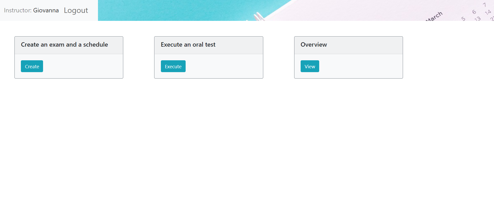
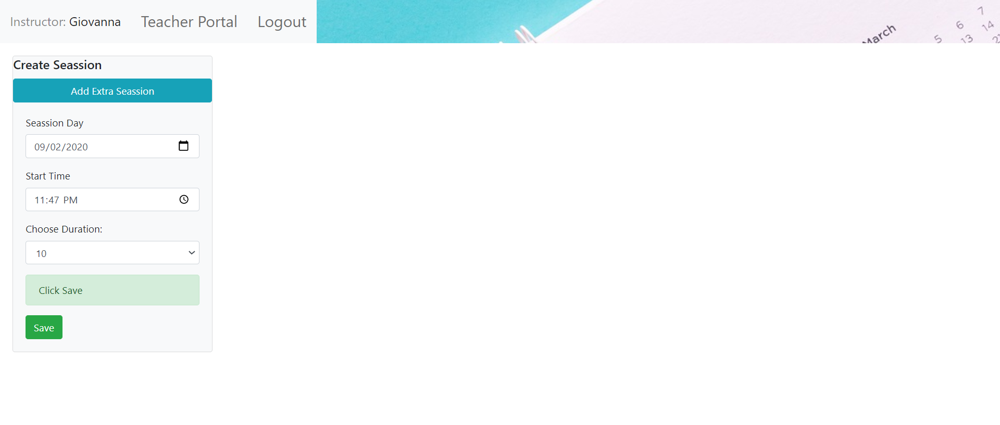
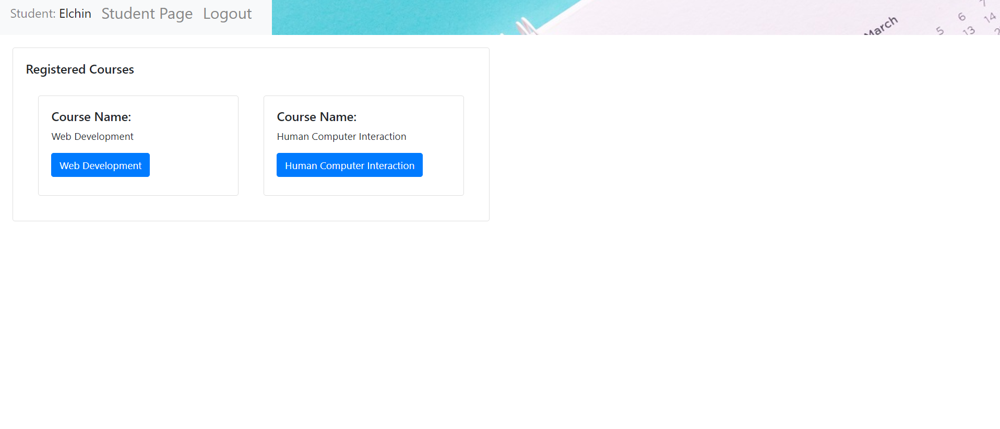

# Exam #12345: "Exam Title"
## Student: s276337 Fahradov Elchin 

## React client application routes
-  Route `/student/`: Student login page.
- Route `/student/portal`: Student main page. For redirecting different pages
-  Route `/teacherLogin`: Teacher login page.
-  Route `/teacher/portal`: Teacher main page. For redirecting different pages

## REST API server

- POST `/api/login`
  - request parameters and request body content
  - response body: Username
-  POST `/api/logout`
     - logout for student 
- GET `/api/studentLogin/:sid`
  - request parameters
  -  StudentID

- POST `/api/student/cancelBookedSlot`
  - Student cancel for booked slot
  - response body: reserved Slot ID

- POST `/api/teacher/insertSlot`
  - Teacher insert created slot into DB
  - response body: slot paramaters

- GET `/api/student/listAvailableSlots/:TID`
  - Student get all available slots for choosen course
  - Teacher ID, (each teacher has unique course) 
  
  
- GET `/api/student/checkStudentBookAccess/:TID/:SID`
  - Get student registered Course List
  -  Teacher ID, Student ID

- GET `/api/student/listRegisteredSlots/:SID`
  - Get registered Slots
  -  Student ID

- GET `/api/student/getStudentName/:SID`
  - Get student name 
  - Student ID

- GET `/api/student/getRegisteredCourses/:SID`
  - Get registered courses 
  -  Student ID

- POST `/api/student/bookAvailableSlot`
  - Book Availability Slot
  - response body: ReservedStudent, SlotID

- GET `/api/teacher/getTeacherId/:name`
  - Get teacher ID 
  -  Teacher name

- POST `/api/teacher/auth`
  - teacher authentication
  -  response body: User ID

- POST `/api/teacher/updateCheckedStudents`
  - Checked Students by Teacher
  -  response body: list of checked students

- POST `/api/teacher/updateStudentGrade`
  - teacher update student grade
  -  Student ID

- GET `/api/teacher/allStudentlist/:tid`
  - Registered Student list for specific course
  -  Student List

- GET `/api/teacher/listReservedSlots/:TID`
  - List Reserved Slots by Students
  -  Reserved Slot List

- GET `/api/teacher/overviewReservedSlots/:TID`
  - Overview Reserved Slot List
  -  Reserved Slot List

- GET `/api/teacher/checkedStudentlist/:tid`
  - Checked Student List for specific exam seassion
  -  Student List

## Server database

- Table `Student` - contains SID name
- Table `Teachers` - contains TID name CourseName password 
- Table `Slot` - contains SlotID TeacherID StartDate StartTime Duration ReservedStudent Grade Attendance
- Table `Student_Teacher` - contains STID SID StudentName TID Checked CourseName

## Main React Components

- `LoginStudent` (in `LoginStudent.js`): Student Login component
- `LoginInstr` (in `LoginInstr.js`): Instructor Login component
- `CreateExam` (in `CreateExam.js`): Create Exam component by Teacher
- `ExecuteExam` (in `ExecuteExam.js`): Teacher estimate student oral exam 
- `OverviewExam` (in `Overview.js`): Teacher see choosen Student List and graded or ungraded slots reserved by students
-  `AddExtraSeassion` (in `AddExtraSeassion.js`): Teacher add new Slots if choosen duration is not enough
- `Teacher` (in `Teacher.js`): Teacher main page 
- `Student` (in `Student.js`): Student main page

## Screenshot

## Test users
Teachers
* Luca, password
* Giovanna, password

Students
* S1, S2, S3, S4, S5, S6, S7, S8, S9, S10, S11, S12, S13, S14, S15, S16, S17, S18, S19, S20, S21, S22
